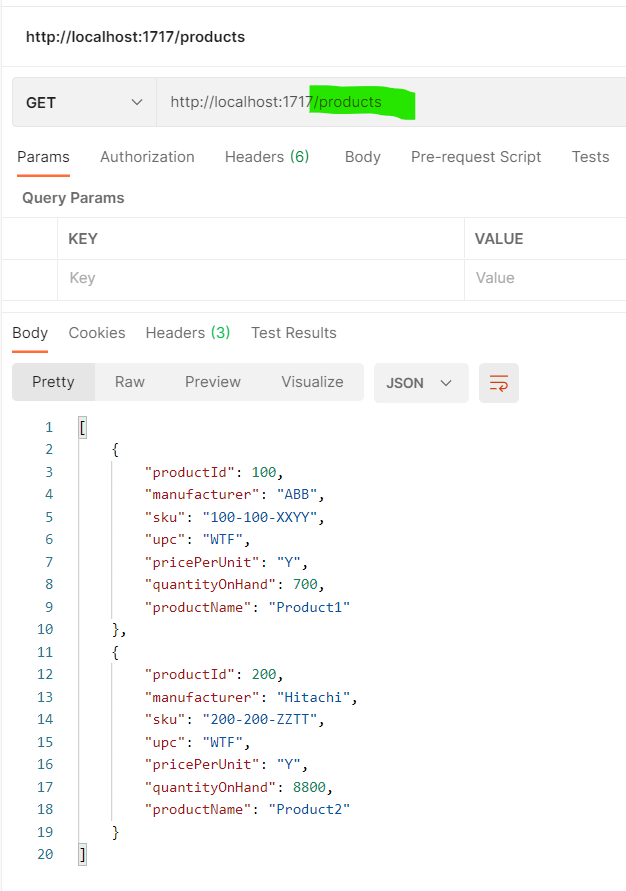

## Install node.js
[Installation directives](https://muhammetkucuk.com/install-node-js-from-linux-tar-gz-file/)
[Installation](https://github.com/nodesource/distributions/blob/master/README.md)

## Install angular CLI for building project && install dependencies
```bash
cd inventory-mgmt
npm install -g @angular/cli
npm install
```


## Run Application

```bash
ng serve --open
```


## Testing Basic HTTP Handlers

### bar endpoint (*`GET`*)


### baz endpoint (*`GET`*)


### products endpoint (*`GET`*)

